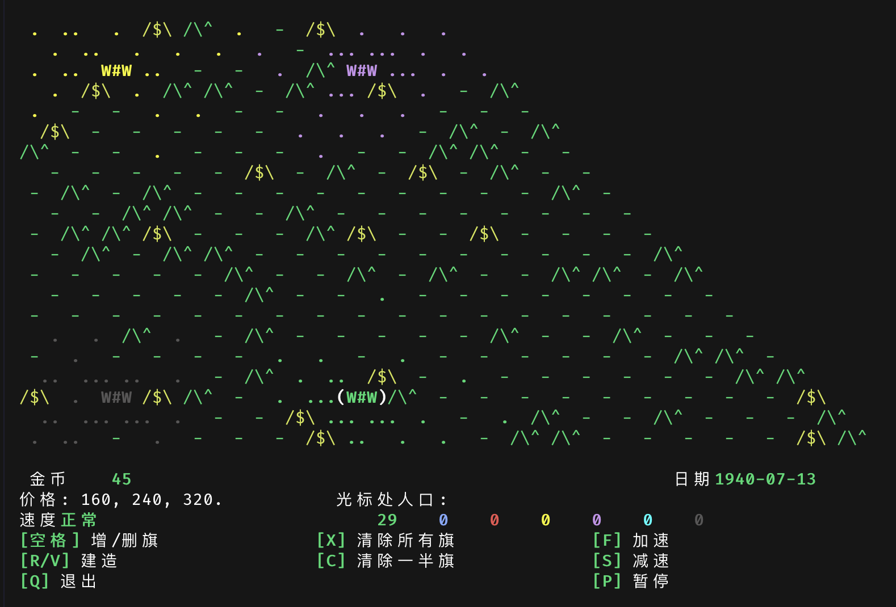

# Curse of War — Rust Re-implementation

[](./LICENSE)

> A faithful Rust port of [Curse of War 1.3.0](https://github.com/a-nikolaev/curseofwar) by Alexey Nikolaev (2013), with a **Chinese UI by default**.

It's a fast-paced strategy game on a hex grid: you don't command individual units — you plan at a high level (build infrastructure, secure resources, move armies). The mechanics loosely resemble WWI/WWII-era warfare, though no historical period is referenced.



## Gameplay

At the start of the game every country takes a corner of the map with a castle and two gold mines nearby. The map is made of hex tiles:

| Glyph | Terrain | Meaning |
|---|---|---|
| `/\^` | Mountain | Impassable; blocks armies |
| `/$\` | Mine | If all six surrounding tiles are yours, you earn gold each step |
| `-`  | Grassland | Ordinary habitable tile; population density shown by dot patterns |
| `n`  | Village | Population growth +10% |
| `i=i`| Town | Population growth +20% |
| `W#W`| Castle | Population growth +30% |

Population is your primary resource. Each tile holds at most 499 citizens per country; when multiple countries share a tile they fight. Population **migrates on its own** — it gathers where your country has placed flags. Owning a cities lets you control the surrounding territory; if a cities takes heavy damage it downgrades (castle → town → village → grassland).

### Key bindings

| Key | Action |
|---|---|
| `H` `J` `K` `L` / arrow keys | Move the cursor (hex grid) |
| `Space` | Place / remove a flag at the cursor (flags attract population) |
| `R` / `V` | Build (grassland → village 160 gold → town 240 gold → castle 320 gold) |
| `X` | Remove all your flags |
| `C` | Remove half your flags |
| `F` / `S` | Speed up / slow down |
| `P` | Pause / resume |
| `Q` | Quit (Y/N confirmation dialog) |

Victory: wipe out every other country's population. Defeat: your population reaches 0.

## Command-line options

Faithfully mirrors the original game's argument set:

```
-W width   -H height   -S shape (rhombus|rect|hex)
-l locations  -i inequality (0-4)  -q quality
-r  -d difficulty (ee|e|n|h|hh)  -s speed (p|sss|ss|s|n|f|ff|fff)
-R seed  -T timeline  -v  -h
-E/-e/-C/-c   multiplayer (not implemented in this build; friendly notice on use)
--lang zh|en   language (default Chinese; also honour $COW_LANG and $LANG)
```

A few handy examples:

```bash
curseofwar --lang en                # English interface
curseofwar -W 18 -H 18 -R 7         # small map + fixed seed (reproducible)
curseofwar -i 4 -q 1 -d ee          # max inequality, best spawn, easiest AI (good for beginners)
```

## Differences from the original

This repository is a **faithful re-implementation** — all game rules and command-line options match the original. As an independent release, however, the following differences are **intentional**:

- **TUI only**: ratatui + crossterm replaces the original ncurses + SDL1 dual frontends.
- **No multiplayer**: the original UDP client/server is parsed but exits with a friendly notice.
- **Different RNG**: `StdRng` (ChaCha12) replaces `glibc rand()`. Same-seed runs are reproducible within this implementation, but will **not** produce the same map as the original C program.
- **Default language**: Chinese. The English option is always available.
- **License**: GPLv3-or-later (derived work).

## Credits & License

Derived from [Curse of War](https://github.com/a-nikolaev/curseofwar) by Alexey Nikolaev, distributed under the GPLv3. Every source file retains the original copyright and the derived-work disclaimer.

```
Curse of War -- Real Time Strategy Game for Linux.
Copyright (C) 2013 Alexey Nikolaev.

This program is free software: you can redistribute it and/or modify
it under the terms of the GNU General Public License as published by
the Free Software Foundation, either version 3 of the License, or
(at your option) any later version.
```

Full license text is in [`LICENSE`](./LICENSE) at the repository root.