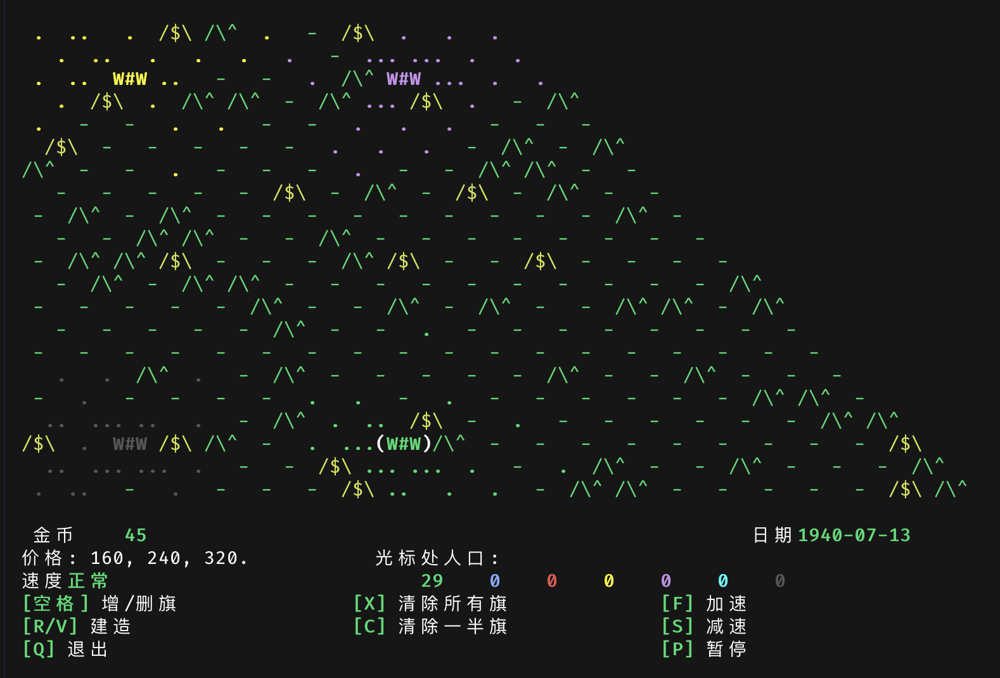

# Curse of War — Rust Re-implementation · Terminal RTS in Rust (TUI)

[](./LICENSE)
[](https://www.rust-lang.org)
[](https://github.com/ratatui/ratatui)
[](https://github.com/lunrenyi/curseofwar-rs/stargazers)

A faithful **Rust re-implementation of [Curse of War 1.3.0](https://github.com/a-nikolaev/curseofwar)** (the classic Linux hex-grid RTS by Alexey Nikolaev, 2013), rebuilt as a modern **terminal / TUI strategy game** with **Chinese UI by default**.

Curse of War is a fast-paced **real-time strategy game** played on a hex grid — you don't command individual units, you plan at a high level: build infrastructure, secure gold mines, move armies. This Rust port keeps every rule, every command-line flag, and every terrain glyph, but ships as a single, dependency-light **terminal application** that runs anywhere a real terminal opens: Linux, macOS, Windows, and over SSH.



## Why a Rust port?

There are several `Curse of War` ports in the wild. This one is differentiated by three choices — see [`README.cn.md`](./README.cn.md) § 与原版的差异 and [`README.en.md`](./README.en.md) § Differences from the original for the full list:

- **Modern terminal-only build.** Built on [`ratatui`](https://github.com/ratatui/ratatui) + [`crossterm`](https://github.com/crossterm-rs/crossterm) — no X11, no SDL, no ncurses quirks. Works in tmux, over SSH, in CI, on a Raspberry Pi, on a server without a display.
- **Chinese UI by default.** Every string is localised; switch back to English any time via `--lang en`, `$COW_LANG`, or `$LANG`. Useful as a study artifact for terminal i18n.
- **Two-crate Rust workspace.** Game logic lives in `cow-core` (no UI / IO dependencies) and the terminal front-end in `cow-tui`. The split makes the rule engine reusable for bots, headless simulations, or future ports to other front-ends.

## Quick start

```bash
git clone https://github.com/lunrenyi/curseofwar-rs
cd curseofwar-rs
cargo run --release -p cow-tui                 # default: Chinese UI, default map
cargo run --release -p cow-tui -- --lang en    # English UI
cargo run --release -p cow-tui -- -W 18 -H 18 -R 7   # small reproducible map
```

You need a **Rust toolchain 1.75 or newer** (`rustup default stable` is enough).

## Key bindings (defaults)

| Key | Action |
|---|---|
| `H` `J` `K` `L` / arrow keys | Move the cursor on the hex grid |
| `Space` | Place / remove a flag at the cursor (flags attract population) |
| `R` / `V` | Build (grassland → village 160 g → town 240 g → castle 320 g) |
| `X` | Remove all your flags |
| `C` | Remove half your flags |
| `F` / `S` | Speed up / slow down |
| `P` | Pause / resume |
| `Q` | Quit (Y/N confirmation) |
| `?` | Show gameplay help (press `?` or `Esc` to close) |

Victory: wipe out every other country's population. Defeat: your population reaches 0.

## Command-line options

Faithfully mirrors the original game's argument set:

```
-W width   -H height   -S shape (rhombus|rect|hex)
-l locations  -q quality  -i inequality (0-4)
-r  -d difficulty (ee|e|n|h|hh)  -s speed (p|sss|ss|s|n|f|ff|fff)
-R seed  -T timeline  -v  -h
-E/-e/-C/-c   multiplayer (parsed; not implemented in this build)
--lang zh|en   language (default Chinese; also honour $COW_LANG and $LANG)
```

## Documentation

- **[中文文档](./README.cn.md)** — 玩法、键位、命令行参数、与原版的差异
- **[English](./README.en.md)** — Gameplay, key bindings, command-line options, differences from the original

## Repository layout

```
curseofwar-rs/
├── README.md            this file (entry point, keyword-rich landing page)
├── README.cn.md         Chinese documentation (玩法、键位)
├── README.en.md         English documentation (gameplay, key bindings)
├── LICENSE              GPLv3-or-later full text
├── Cargo.toml           Cargo workspace manifest
└── crates/
    ├── cow-core/        game-logic library (no UI/IO deps)
    └── cow-tui/         terminal front-end (ratatui + crossterm)
```

## Credits & License

Derived from [Curse of War](https://github.com/a-nikolaev/curseofwar) by Alexey Nikolaev (2013), distributed under the GPLv3. Every source file retains the original copyright and the derived-work disclaimer. See [`LICENSE`](./LICENSE) for the full text.

```
Curse of War -- Real Time Strategy Game for Linux.
Copyright (C) 2013 Alexey Nikolaev.

This program is free software: you can redistribute it and/or modify
it under the terms of the GNU General Public License as published by
the Free Software Foundation, either version 3 of the License, or
(at your option) any later version.
```

## See also

- Original C implementation — <https://github.com/a-nikolaev/curseofwar>
- Other Rust ports of Curse of War — search GitHub for [`curseofwar rust`](https://github.com/search?q=curseofwar+rust&type=repositories)
- Author profile and other projects — [@lunrenyi](https://github.com/lunrenyi)